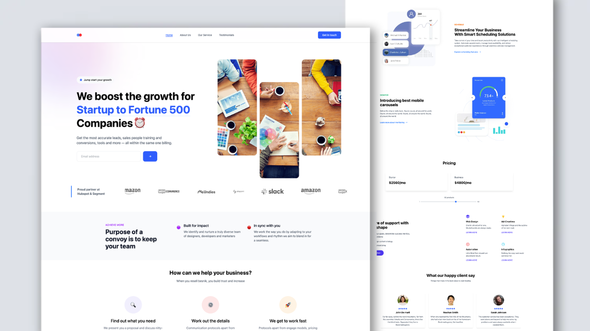

# YANGG - Young African Network for Global Goals



A modern, responsive website for YANGG (Young African Network for Global Goals) - empowering African youth through leadership, innovation, and civic engagement. Built with React, Tailwind CSS, and Framer Motion animations.

## 🌟 About YANGG

YANGG is a pan-African youth-led organization operating across Nigeria, Gambia, Kenya, and Ghana. We empower young Africans to become producers, not just consumers—building homegrown solutions that drive digital transformation and sustainable development across the continent.

## ✨ Features

- Modern and clean design with African-centered branding
- **Dark Mode Toggle** - Smooth theme switching with persistence ✨
- Fully responsive layout (mobile, tablet, desktop)
- Smooth animations with Framer Motion
- Interactive components with hover effects
- Events showcase with status tracking
- Photo gallery with filtering and lightbox
- Testimonials carousel from real community members
- Newsletter subscription form
- Programs showcase
- Multi-country presence display

## 🎯 Our Programs

1. **Leadership Academy** - Comprehensive leadership training
2. **Afripreneur** - Entrepreneurship support for young innovators
3. **She Leads** - Women empowerment initiative
4. **SDG Training** - Sustainable Development Goals education

## 🛠️ Built With

- React.js 19
- Tailwind CSS 4 (with dark mode support)
- Framer Motion 12
- Swiper.js 11
- React Icons 5
- Vite 6
- Context API for theme management

## 🚀 Getting Started

### Prerequisites

- Node.js (v14 or higher)
- npm or yarn

### Installation

1. Clone the repository
```bash
git clone https://github.com/yourusername/yangg-website
cd yangg-website
```

2. Install dependencies
```bash
npm install
```

3. Start the development server
```bash
npm run dev
```

4. Build for production
```bash
npm run build
```

## 📦 Project Structure

```
src/
├── components/
│   ├── Navbar.jsx (with dark mode toggle)
│   ├── Hero.jsx
│   ├── CompanyLogo.jsx
│   ├── PurposeSection.jsx (About)
│   ├── FeaturesSection.jsx
│   ├── ScheduleSection.jsx (Impact)
│   ├── MonitorSection.jsx (Digital)
│   ├── ServicesSection.jsx (Programs)
│   ├── EventsSection.jsx ⭐NEW
│   ├── GallerySection.jsx ⭐NEW
│   ├── TestimonialsSection.jsx
│   ├── NewsletterSection.jsx
│   └── Footer.jsx
├── context/
│   └── ThemeContext.jsx ⭐NEW (Dark mode)
├── assets/
│   ├── data.js (Content data)
│   └── motion.js (Animation variants)
├── utils/
│   └── motion.js (Animation utilities)
├── App.jsx
├── main.jsx
└── index.css
```

## 🎨 Customization

### Update Content
1. Modify text and data in `src/assets/data.js`
2. Update component content in respective files
3. Replace images with your own assets

### Update Branding
1. Change colors in component files (blue-600, green-500)
2. Update logo in Navbar and Footer
3. Modify brand messaging in Hero section

### Update Programs
Edit the programs array in `src/components/ServicesSection.jsx`

### Update Events
Edit the events array in `src/components/EventsSection.jsx`

### Update Gallery
Edit the galleryItems array in `src/components/GallerySection.jsx`

### Toggle Dark Mode
Click the sun/moon icon in the top right of the navbar. Theme preference is automatically saved.

## 📱 Sections

1. **Hero** - Main headline and call-to-action
2. **Company Logo** - Countries where YANGG operates
3. **About** - Mission and values
4. **Features** - Three-step approach
5. **Impact** - Statistics and reach
6. **Digital** - Technology focus
7. **Programs** - Four main programs
8. **Events** - Upcoming and past events ⭐NEW
9. **Gallery** - Photo gallery with filters ⭐NEW
10. **Testimonials** - Success stories
11. **Newsletter** - Community signup
12. **Footer** - Links and contact

## 🌍 Countries

- 🇳🇬 Nigeria (Headquarters)
- 🇬🇲 Gambia
- 🇰🇪 Kenya
- 🇬🇭 Ghana

## 📝 License

This project is licensed under the MIT License.

## 🤝 Contributing

Contributions, issues, and feature requests are welcome!

## 📧 Contact

- Website: [yangg.org](https://yangg.org)
- Email: info@yangg.org
- Social Media: Facebook | Twitter | Instagram | LinkedIn

## 🙏 Acknowledgments

- Built with modern web technologies
- Inspired by African youth leadership
- Designed for impact and accessibility

---

**Empowering African Youth to Shape the Future** 🌍✨


